# kimiteam ↔ kimi 嵌入（耦合）情况

> 分支 `feat/subagent-team` · 记录日期 2026-08-06
> 依据：墨轩启动提示词盘点（`.tmp/startup-prompt-inventory.md`）+ 路遥插件系统调研 + 主管提示词优化收口（`ff7b11ec4`）
> 目的：明确 kimiteam 各能力与官方 kimi 引擎的耦合层级，评估「剥离成独立包 / 上架 /plugins」的可行性边界。

## 耦合总览（mermaid）

```mermaid
flowchart TB
    subgraph OFFICIAL["kimi (官方引擎 main 分支)"]
        CORE["引擎核心<br/>DI 容器 / Loop / 工具执行器<br/>profile / context / system.md 模板<br/>configSection / 会话 / wire"]
        SUB["Subagent 基建<br/>subagentService / idleReaper<br/>swarm / duty / mirrorAgentRun"]
        PERF["绩效记录<br/>agentPerformanceService"]
        TODO["Todo 基建<br/>todoItem / sessionTodoService"]
        HOOK["Hooks 系统<br/>externalHooks (21 事件)"]
        TUI["TUI 骨架<br/>commands/registry / dispatch<br/>TodoPanel / 面板框架"]
    end

    subgraph KIMITEAM_DEEP["kimiteam · 深侵入（改官方核心文件，不可剥离）"]
        D1["profiles.ts<br/>AGENT_ROLE（总经理定位）<br/>+ Team* 工具白名单"]
        D2["context.ts / profileService.ts<br/>model-roster 注入链<br/>（仅 main 门控）"]
        D3["system.md 模板<br/>+ model_roster_section<br/>+ pipeline 段"]
        D4["agentTool.ts / agentSwarmTool.ts<br/>doctrine 注入 + todo_id 强校验"]
        D5["configSection.ts<br/>[subagent] 配置节<br/>team_mode / 限时 / 保活参数"]
        D6["todoItem.ts / sessionTodoService<br/>TodoItem 扩展 + 回写方法"]
    end

    subgraph KIMITEAM_HOOK["kimiteam · 扩展点挂载（新增文件走官方注册点，可独立成包）"]
        E1["Team* 工具 5 件<br/>team-hire/fire/score/message/concurrency<br/>registerAgentToolService"]
        E2["todoCounterService<br/>App 级自增号（~/.kimi-code/agents/）"]
        E3["leadTurnTimeoutService<br/>主管 30s 限时打断"]
        E4["dailyReviewService<br/>每日低分复盘"]
        E5["subagentWarmService<br/>KV 保活（1 token / 30min）"]
        E6["dutyScheduler / sessionSwarmService<br/>停靠池 / LRU 选人 / 后台批派"]
    end

    subgraph KIMITEAM_APP["kimiteam · 应用层（TUI / Web，独立文件）"]
        A1["/team 命令 + TeamPanel"]
        A2["/todo 命令 + TodoPanel<br/>completedTodos 累积"]
        A3["kimi-web TeamPanel.vue<br/>（web 团队面板）"]
    end

    subgraph KIMITEAM_DATA["kimiteam · 纯数据资产（完全可剥离，插件可带走）"]
        P1["team-lead-doctrine.md<br/>《管理学》+ 不阻塞 + 总经理"]
        P2["model-roster.md<br/>模型能力/限制/幻觉表"]
        P3["pipeline.md 全局+项目"]
        P4["AGENTS.md 层级"]
        P5["skills（team-init 等）"]
    end

    CORE --> D1 & D2 & D3 & D4 & D5 & D6
    SUB --> E5 & E6
    TODO --> D6 & E2
    PERF --> E4
    HOOK --> E3
    TUI --> A1 & A2
    TUI --> P1

    D1 -.->|工具白名单| E1
    D4 -.->|注入| P1
    D2 -.->|加载| P2
    D3 -.->|渲染| P3 & P4 & P5

    classDef deep fill:#fde2e2,stroke:#c0392b,color:#7f1d1d
    classDef hook fill:#fff3cd,stroke:#b7791f,color:#744210
    classDef app fill:#e2f0fd,stroke:#2b6cb0,color:#2c5282
    classDef data fill:#e6f9e6,stroke:#38a169,color:#22543d
    classDef official fill:#f7f7f7,stroke:#718096,color:#2d3748

    class D1,D2,D3,D4,D5,D6 deep
    class E1,E2,E3,E4,E5,E6 hook
    class A1,A2,A3 app
    class P1,P2,P3,P4,P5 data
    class CORE,SUB,PERF,TODO,HOOK,TUI official
```

## 耦合层级表

| 层 | 颜色 | 含义 | 可剥离性 |
|---|---|---|---|
| 深侵入 | 红 | 直接改写官方核心文件（profiles.ts / context.ts / system.md / agentTool / configSection / todoItem），与 kimi 引擎**编译期耦合** | ❌ 必须随分支走 |
| 扩展点挂载 | 黄 | 新增独立文件，挂官方 `registerAgentToolService` 等注册点 | ⚠️ 可独立成包，但注册点依赖引擎 |
| 应用层 | 蓝 | /team、/todo 命令、web 面板（独立 TUI/Web 文件） | ⚠️ 可独立，依赖引擎 RPC |
| 纯数据资产 | 绿 | doctrine / roster / pipeline / AGENTS.md / skills（纯文本提示词） | ✅ **插件可直接带走**（路遥调研确认） |

## 关键结论

1. **kimiteam 价值主体（红+黄）全部嵌在引擎内**——改官方核心文件或挂引擎注册点；绿色资产才是插件能带走的壳。
2. **/plugins 上架可行性**：插件 manifest 显式不支持 `tools` / `inject` / `configFile` / `bootstrap`（`UNSUPPORTED_RUNTIME_FIELDS`），所以 Team* 工具、team mode 门控、swarm/调度、todo 挂钩、动态 roster、turn 打断全部进不去；能打包的只有绿层（skills + systemPrompt + commands + agents）。
3. **若要彻底剥离**：需引擎提供扩展接口（插件化的工具/配置/注入点），超出当前 /plugins 能力边界；官方对深耦合能力的现有通道是 capability 流（kimi-cu / kimi-webbridge 同款），但需 Moonshot 收录。

## 相关记录

- 启动注入提示词盘点：`.tmp/startup-prompt-inventory.md`
- 团队特性索引：`team-features-index.md`
- 主管提示词优化：`lead-turn-timeout.md`（限时机制）、`score-penalty.md`（扣分机制）
